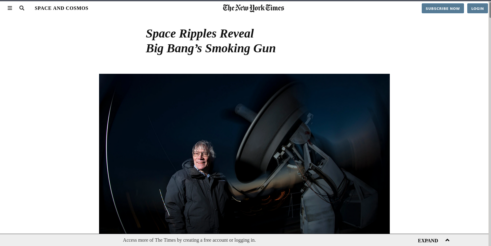

# New-York-Times

# What it does
It is a clone of the New York Times article page.

## Built With
- HTML
- CSS
#### and deployed to Github

## Live Demo

[Live Demo](https://dazzling-aryabhata-a680c0.netlify.com/)

## Getting Started

To get a local copy up and running follow these simple example steps.
- Clone the project unto your local machine
- `cd` into the project directory
- Open up index.html in your browser to view the project

## Authors

## Author1

Github: @kelibst
Twitter: @keli_booster
Linkedin: Kekeli (Jiresse) Dogbevi

## Author2

Github: @Buyaki01
Twitter: @BuyakiRitta
Linkedin: https://www.linkedin.com/in/ritta-buyaki-b12904128/

## 🤝 Contributing

Feel free to check the [issues page](https://github.com/kelibst/New-York-Times/issues).

## Attributions and Credit
Special thanks to Microverse!

## Show your support

Give a ⭐️ if you like this project!

## 📝 License

This project is licensed by Microverse.

### Enjoy!
